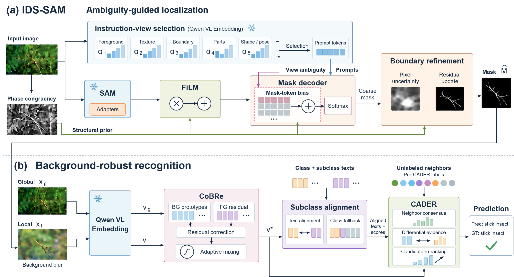
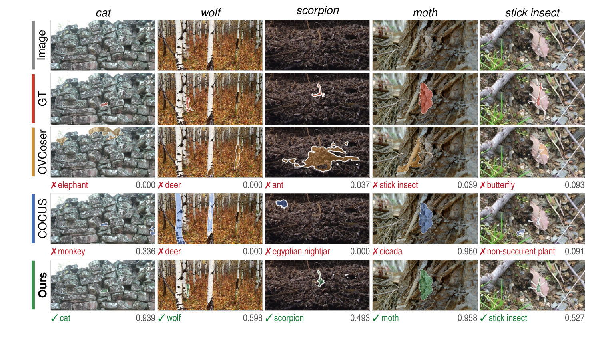

<div align="center">

# IDS-SAM + CoBRe + CADER

### Uncertainty-Guided Structural Routing and Consensus-Aware Re-Ranking for Open-Vocabulary Camouflaged Object Segmentation

**ACCV 2026**

Jisang Lee*, SeoYeon Oh*, Cheoneum Park†, Haneol Jang†  
Hanbat National University  
*Equal contribution · †Corresponding authors

</div>

This repository provides training, inference, and evaluation for our OVCOS pipeline. IDS-SAM predicts a class-agnostic camouflage mask. CoBRe corrects the global–local recognition embedding, subclass alignment refines the candidate scores, and CADER re-ranks the fixed candidate set using unlabeled image neighbors.



## Installation

Use Python 3.10 or newer and a CUDA-enabled PyTorch installation. The tested core environment uses PyTorch 2.5.1 and CUDA 12.1. Install PyTorch and TorchVision as a matched pair following [the official instructions](https://pytorch.org/get-started/locally/).

```bash
python -m venv .venv
source .venv/bin/activate
pip install torch==2.5.1 torchvision==0.20.1 --index-url https://download.pytorch.org/whl/cu121
pip install -e '.[embedding,dev]'
ovcos --help
```

For training and recognition with precomputed embeddings, `pip install -e .` installs the core package. The `embedding` extra adds the Qwen embedding backend. All commands also work as `python -m ovcos ...`.

## Data and model preparation

Download OVCamo from [the official dataset repository](https://github.com/lartpang/OVCamo). Keep its provided train/test split: 7,713 images from 14 seen categories for training and 3,770 images from 61 unseen categories for evaluation.

```text
data/ovcamo/
├── dataset/
│   ├── class_info.json
│   └── sample_info.json
└── ovcamo_dataset/
    ├── train/
    │   ├── image/
    │   └── mask/
    └── test/
        ├── image/
        └── mask/
```

```bash
ovcos prepare-data --root data/ovcamo --output data/manifests
```

Model weights are supplied separately. Put the original [SAM ViT-H checkpoint](https://github.com/facebookresearch/segment-anything#model-checkpoints) at `checkpoints/sam_vit_h_4b8939.pth`. The embedding commands accept a local Qwen model directory or the Hugging Face model ID `Qwen/Qwen3-VL-Embedding-8B`. IDS-SAM and CoBRe checkpoints are written by the training commands below.

## 1. Extract instruction embeddings

The five fixed instructions are in [`ovcos/embeddings/prompts.py`](ovcos/embeddings/prompts.py). Extraction writes an image bank `[N,5,D]`, a text bank `[5,D]`, and an exact image-ID index.

```bash
CUDA_VISIBLE_DEVICES=0 ovcos extract-instructions \
  --manifest data/manifests/train.jsonl \
  --model Qwen/Qwen3-VL-Embedding-8B \
  --output cache/instructions/train

CUDA_VISIBLE_DEVICES=0 ovcos extract-instructions \
  --manifest data/manifests/test.jsonl \
  --model Qwen/Qwen3-VL-Embedding-8B \
  --output cache/instructions/test
```

## 2. Train IDS-SAM

The pretrained SAM image encoder is frozen except for its encoder adapters. The instruction projections, decoder adaptation, structural paths, and boundary modules are trainable. The default recipe uses 20 epochs, AdamW, a learning rate of `2e-4`, and batch size 1 per GPU.

```bash
CUDA_VISIBLE_DEVICES=0,1,2 torchrun --standalone --nproc_per_node=3 -m ovcos train-segment \
  --manifest data/manifests/train.jsonl \
  --instruction-cache cache/instructions/train \
  --sam-checkpoint checkpoints/sam_vit_h_4b8939.pth \
  --output outputs/idsam
```

For a single GPU, replace `torchrun --standalone --nproc_per_node=3 -m ovcos` with `ovcos`. The final checkpoint is `outputs/idsam/last.pth`. To select a checkpoint using a validation split, add `--val-manifest` and `--val-instruction-cache`; the best validation IoU checkpoint is saved as `best.pth`. Use `--resume outputs/idsam/last.pth` to restore model, optimizer, and scheduler state.

The configuration is [`ovcos/configs/idsam.yaml`](ovcos/configs/idsam.yaml). A custom YAML can be selected with `--config`.

## 3. Predict masks

```bash
CUDA_VISIBLE_DEVICES=0 ovcos segment \
  --manifest data/manifests/test.jsonl \
  --instruction-cache cache/instructions/test \
  --checkpoint outputs/idsam/last.pth \
  --output outputs/masks/test

CUDA_VISIBLE_DEVICES=0 ovcos segment \
  --manifest data/manifests/train.jsonl \
  --instruction-cache cache/instructions/train \
  --checkpoint outputs/idsam/last.pth \
  --output outputs/masks/train
```

Each output contains PNG probability masks and a `manifest.jsonl` connecting image IDs to their masks. Image size is preserved. Ground-truth masks and labels are not required for prediction.

## 4. Build recognition caches

The cache command embeds the global image, its mask-conditioned local view, six class-name templates, and the vocabulary's optional subclass descriptors.

```bash
CUDA_VISIBLE_DEVICES=0 ovcos extract-recognition \
  --manifest outputs/masks/train/manifest.jsonl \
  --vocabulary data/manifests/train_vocabulary.json \
  --model Qwen/Qwen3-VL-Embedding-8B \
  --output cache/recognition/train.npz

CUDA_VISIBLE_DEVICES=0 ovcos extract-recognition \
  --manifest outputs/masks/test/manifest.jsonl \
  --vocabulary data/manifests/test_vocabulary.json \
  --model Qwen/Qwen3-VL-Embedding-8B \
  --output cache/recognition/test.npz
```

## 5. Train CoBRe and recognize objects

CoBRe is trained on cached seen-class embeddings. The command records a deterministic 80/20 train/validation split and selects the best checkpoint using label-free recognition on the held-out validation images.

```bash
CUDA_VISIBLE_DEVICES=0 ovcos train-recognizer \
  --cache cache/recognition/train.npz \
  --output outputs/cobre

CUDA_VISIBLE_DEVICES=0 ovcos recognize \
  --cache cache/recognition/test.npz \
  --cobre-checkpoint outputs/cobre/best.pth \
  --output outputs/recognition/test
```

The output contains stage-wise rankings (`fused.json`, `cobre.json`, `subclass.json`, `cader.json`) and recognition metrics when labels are available. All stages use the same fused Top-5 candidates. CADER retrieves neighbors from the other images in the input cache, excludes the query, and uses predicted labels. Run the complete evaluation cache together for batch-transductive inference. Add `--no-cader` for the per-image recognition path or `--no-subclass` to use class names only.

Hyperparameters are in [`ovcos/configs/recognition.yaml`](ovcos/configs/recognition.yaml). CoBRe and the cached image/text embeddings must have matching embedding dimensions.

## 6. Evaluate

```bash
# Class-agnostic localization
ovcos evaluate --manifest outputs/masks/test/manifest.jsonl \
  --output outputs/localization_metrics.json

# Class-aware OVCOS
ovcos evaluate --manifest outputs/masks/test/manifest.jsonl \
  --predictions outputs/recognition/test/cader.json \
  --output outputs/ovcos_metrics.json
```

The evaluator reports structure measure, weighted F-measure, MAE, and adaptive/mean/maximum F-measure, E-measure, and IoU. Class-aware evaluation assigns zero to similarity/overlap metrics and one to MAE when the predicted category is incorrect, following the OVCamo evaluator.

## Custom images and vocabulary

```bash
ovcos manifest --images path/to/images --output data/custom.jsonl
```

Use this manifest with instruction extraction and mask prediction. A vocabulary can be a JSON list of class names or a list of objects with `name` and optional `descriptors` fields. See [`docs/data_formats.md`](docs/data_formats.md) for cache and manifest formats. Recognition with one image uses the sample-wise result because there are no other images to retrieve.

## Results reported in the paper

OVCamo-Unseen, full pipeline with predicted masks:

| Method | cSm ↑ | cFωβ ↑ | cMAE ↓ | cFβ ↑ | cEm ↑ | cIoU ↑ |
|:--|--:|--:|--:|--:|--:|--:|
| OVCoser | 0.579 | 0.490 | 0.336 | 0.520 | 0.616 | 0.443 |
| SuCLIP | 0.667 | 0.594 | 0.242 | 0.633 | 0.722 | 0.540 |
| COCUS | 0.668 | 0.615 | 0.265 | 0.631 | 0.697 | 0.568 |
| **Ours** | **0.752** | **0.691** | **0.168** | **0.711** | **0.788** | **0.635** |

| Recognition stage | Top-1 (%) | Top-5 (%) |
|:--|--:|--:|
| Fused baseline | 81.06 | 93.47 |
| + CoBRe | 81.80 | 93.47 |
| + Subclass alignment | 84.32 | 93.47 |
| + CADER | **85.12** | 93.47 |



## Code organization

```text
ovcos/
├── cli/             # Unified command-line interface
├── configs/         # IDS-SAM and recognition recipes
├── data/            # Manifests, preprocessing, instruction caches
├── embeddings/      # Qwen embedding backend and fixed prompts
├── models/          # IDS-SAM, structural priors, SAM encoder/decoder
├── recognition/     # CoBRe, subclass alignment, neighbor consensus, CADER
├── engine/          # Training, distributed execution, prediction
└── evaluation/      # Class-aware and class-agnostic metrics
tests/               # Forward/backward, checkpoint, cache, and protocol tests
docs/                # Data formats and implementation guide
assets/              # Camera-ready overview and qualitative figure
licenses/            # Third-party license notices
```

Model parameter names retain checkpoint compatibility. Public entry points and file names follow the pipeline components. All dataset, output, model, and cache paths are arguments rather than machine-specific constants.

## Tests

```bash
python -m pytest -q
ruff check ovcos tests
```

Use `--max-steps 1` for a training smoke test, and `--limit 2` for a short extraction or prediction run. Run details and completed release checks are recorded in [`docs/validation.md`](docs/validation.md).

## Acknowledgments

Our implementation builds on [Segment Anything](https://github.com/facebookresearch/segment-anything), [SAM-Adapter](https://github.com/tianrun-chen/SAM-Adapter-PyTorch), [OVCamo](https://github.com/lartpang/OVCamo), and [Qwen3-VL-Embedding](https://github.com/QwenLM/Qwen3-VL-Embedding). Third-party source attributions are listed in [`THIRD_PARTY_NOTICES.md`](THIRD_PARTY_NOTICES.md). OVCamo images in the qualitative figure remain subject to the dataset's terms.

## Citation

```bibtex
@inproceedings{lee2026ovcos,
  title={Uncertainty-Guided Structural Routing and Consensus-Aware Re-Ranking for Open-Vocabulary Camouflaged Object Segmentation},
  author={Lee, Jisang and Oh, SeoYeon and Park, Cheoneum and Jang, Haneol},
  booktitle={Asian Conference on Computer Vision},
  year={2026}
}
```
